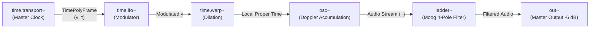

# Relativistic Modular Workstation — DSP & System Architecture

## 1. Tri-Domain Port Architecture

The system operates across three interconnected data domains with strict color coding:

```
+-------------------------------------------------------------------------------+
|                        TRI-DOMAIN DATA STREAM BUS                             |
+-------------------------------------------------------------------------------+
| 1. Message Domain (Gold)        | Control data, parameter automation, triggers|
| 2. Relativistic Time (Violet)   | Multi-stream proper time frames (γ, τ, c, w)|
| 3. Audio Domain (Cyber Cyan)    | 96 kHz continuous float audio streams (~)   |
+-------------------------------------------------------------------------------+
```

### Port Data Types:
1. **`PortDataType::Message` (Gold Accent)**:
   - Asynchronous and block-synchronous control commands e.g. `freq 440`, `cutoff 1200`, `play`, `stop`.
   - Inlet 0 is standard `msgIn`; Outlet 0 is standard `msgOut`.
2. **`PortDataType::Time` (Royal Violet)**:
   - Relativistic telemetry passed via `TimePolyFrame`.
   - Modulates pitch through Doppler velocity accumulation:
     $$\Delta\phi = \frac{f_{\text{base}}}{f_s} \cdot \gamma(t)$$
3. **`PortDataType::Audio` (Cyber Cyan `~`)**:
   - High-fidelity continuous stereo audio buffers ($96\text{ kHz}$ / $64\text{-bit}$ internal DSP).

---

## 2. Relativistic Time Dilation Engine



### Key Mathematical Formulations:
1. **Proper Time Step**:
   $$\tau[n] = \tau[n-1] + \gamma[n] \cdot \Delta t$$
2. **Doppler Phase Increment**:
   $$\phi[n] = \left(\phi[n-1] + \frac{f \cdot \gamma[n]}{f_s}\right) \bmod 1.0$$
3. **Gravitational Redshift ($z$)**:
   $$f_{\text{eff}} = f_0 \cdot \sqrt{1 - \frac{2GM}{r c^2}} \cdot \gamma(t)$$
4. **Lorentz Factor ($\gamma$)**:
   $$\gamma = \frac{1}{\sqrt{1 - v^2/c^2}}$$
5. **MIDI Note to Frequency Conversion (`mtof~`)**:
   $$f = 440 \cdot 2^{\frac{m - 69}{12}}$$
6. **Frequency to MIDI Note Conversion (`ftom~`)**:
   $$m = 69 + 12 \cdot \log_2\left(\frac{f}{440}\right)$$

---

## 3. Dynamic Latency Compensation (Pre-Causal Engine)

To support real-time time dilation where $\gamma(t) > 1.0$ (demanding future audio look-ahead):
1. **Dynamic Demand Estimation**:
   - `RelativisticNodeGraph` surveys active nodes and calculates required future horizon:
     $$D_{\text{future}} = \max(\tau_{\text{demand}}, 5.3\text{ ms})$$
2. **Lock-Free Pre-Causal Buffer**:
   - Synthesized audio blocks are stored in a continuous circular buffer.
3. **Cubic Hermite Fractional Reading**:
   - Samples are retrieved via continuous $C^1$ Hermite interpolation with smooth $C^2$ ramp transitions, eliminating all clicks during time warps.

---

## 4. Pure Data / Max Style GUI Control Nodes

| Object | Shape & Design | Primary Interaction |
| :--- | :--- | :--- |
| **`[msg]`** | Pure Data Flag Box (right-edge bevel cut) | Click to trigger message text downstream |
| **`[bang]`** | Square box with glowing circular target ring | Click to flash and emit `"bang"` |
| **`[toggle]`** | Square box with `[X]` (ON) or `[ ]` (OFF) | Click to toggle state ($0 \leftrightarrow 1$) |
| **`[number]`** | Slanted top-right corner notch (`/`) | Drag/edit float or integer value |
| **`[symbol]`** | Text message box with Cyber Cyan border | Stores and emits string symbols |
| **`[radio]`** | Strip of 4 radio buttons `(0) (1) (2) (3)` | Click option to emit index |
| **`[display]`**| Recessed dark terminal display screen | Dynamic real-time readout of upstream values |
